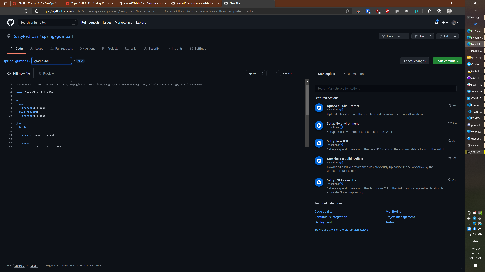
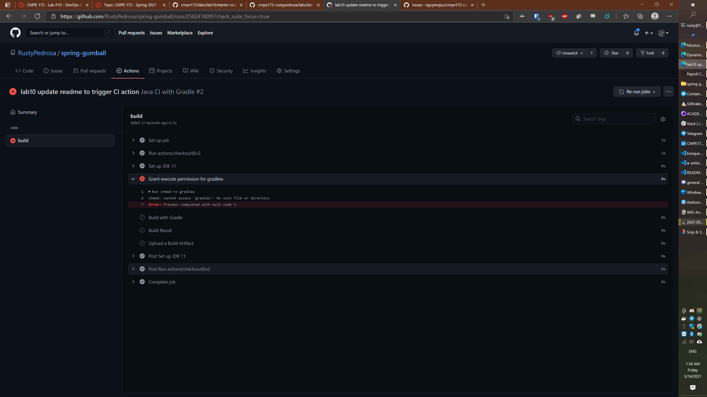
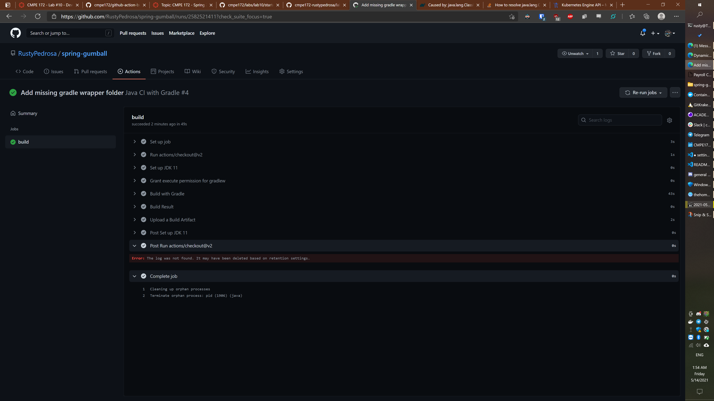
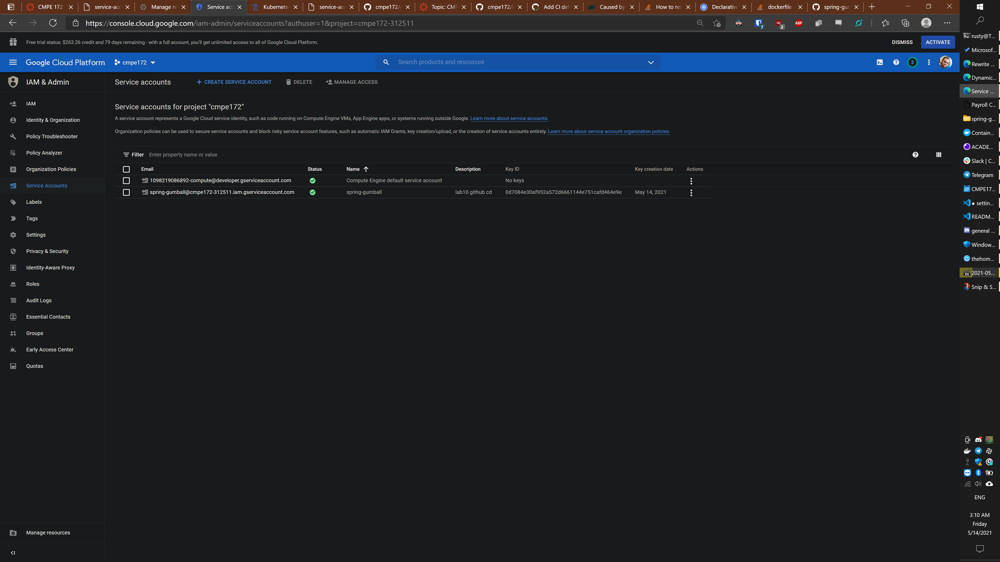
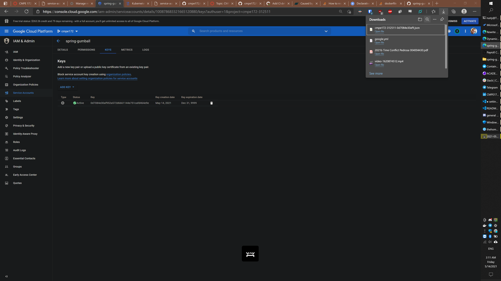
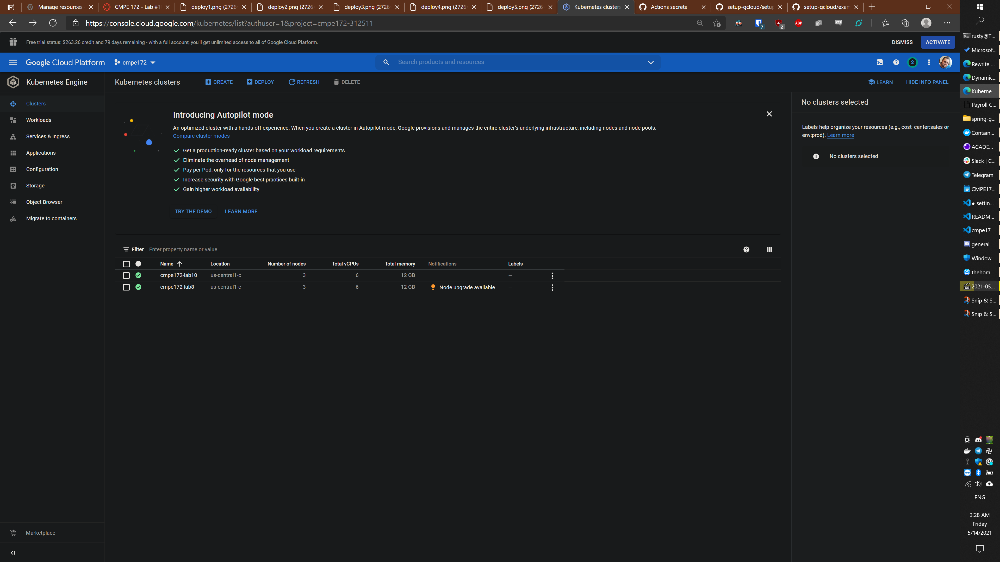

# CMPE 172 - Lab #10 Notes - DevOps CI/CD

I'm experimenting with 4k vs 1080p - sorry for wonky image sizes throughout this lab


Personal repo:
https://github.com/RustyPedrosa/spring-gumball


Private class repo:
https://github.com/nguyensjsu/cmpe172-rustypedrosa/tree/main/labs/lab10

- Created new personal repo and copied starter files
## CI Workflow

* https://help.github.com/actions/language-and-framework-guides/building-and-testing-java-with-gradle

- Created Java Gradle CI: [.github/workflows/gradle.yml](.github/workflows/gradle.yml)


- CI action failed after pushing a commit:


- Looks like we didn't keep the spring-gumball parent folder this time around.  Decided to move all the files up rather than fix all the action files.
- Got another error
```
Run ./gradlew build
Error: Could not find or load main class org.gradle.wrapper.GradleWrapperMain
Caused by: java.lang.ClassNotFoundException: org.gradle.wrapper.GradleWrapperMain
Error: Process completed with exit code 1.
```
- Regenerated missing folder via `gradle wrapper` - looks like stuff got lost because of the initial .gitignore
- Looks like it kinda succeeded, except for some post run cleanup?


- Try moving back to subfolder one more time to make re-use for group project easier
- Figured out that there's a default's item where I can set subfolder.. otherwise each run actions needs a cd or its own working dir
```

defaults:
  run:
    working-directory: ./spring-gumball

jobs:
  ...
```
- Finally got a clean CI run:


## CD Workflow

* https://github.com/google-github-actions/setup-gcloud/tree/master/example-workflows/gke
* https://cloud.google.com/iam/docs/creating-managing-service-accounts
* https://kustomize.io

- Started a new GKE cluster for lab10
- Placed kustomization.yml, deployment.yaml, service.yaml into resources folder

- Created GCP service account and generated key



- Added GKE project ID and GCP SA key (contents of JSON file) to github secrets


- Created google.yml github workflow: [.github/workflows/google.yml](.github/workflows/google.yml)
  - Updated with new cluster for lab10
```
env:
  PROJECT_ID: ${{ secrets.GKE_PROJECT }}
  GKE_CLUSTER: cmpe172-lab10    # TODO: update to cluster name
  ...
```

- Moved GKE CD yml files to repo root

4. Trigger a CD Deployment by creating a new GitHub Release

* Note:  
	* Confirm the Pods and Service have been Deployed to your GKE Cluster
	* Set up a External Facing Load Balancer and Test the Gumball Spring App
	* Web UI should come up on Load Balancer's External IP (as follows)





